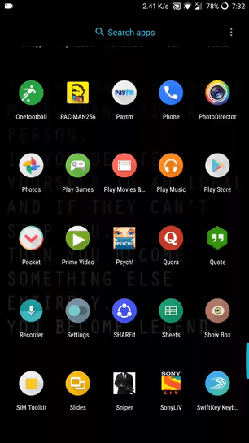

  <h1>QuoteR(andom)</h1>
  
  
  
  >A pretty basic random quote generator for trying out progressive web apps. 

The app has only one button next on pressing which a random quote is displayed and that is pretty much it. 
The implementation was carried out using this [tutorial](https://medium.freecodecamp.org/progressive-web-apps-101-the-what-why-and-how-4aa5e9065ac2) as reference. Feel free to contribute or clone to take this further.

  

Installation:
* visit this [link](https://nurdtechie98.github.io/QuoteRandom/) in your phone browser
* select the add to home screen popup
* voilà, you have successfully installed the **QuoteR** app.

Things Done:
* [X] Try Hands at Progressive Web Apps
* [X] Create a basic service workers to cache data 

Things to be done:
* [ ] Try Push notifications and other native features in PWA
* [ ] Try to improve service worker.
* [ ] Add some feature to the app
